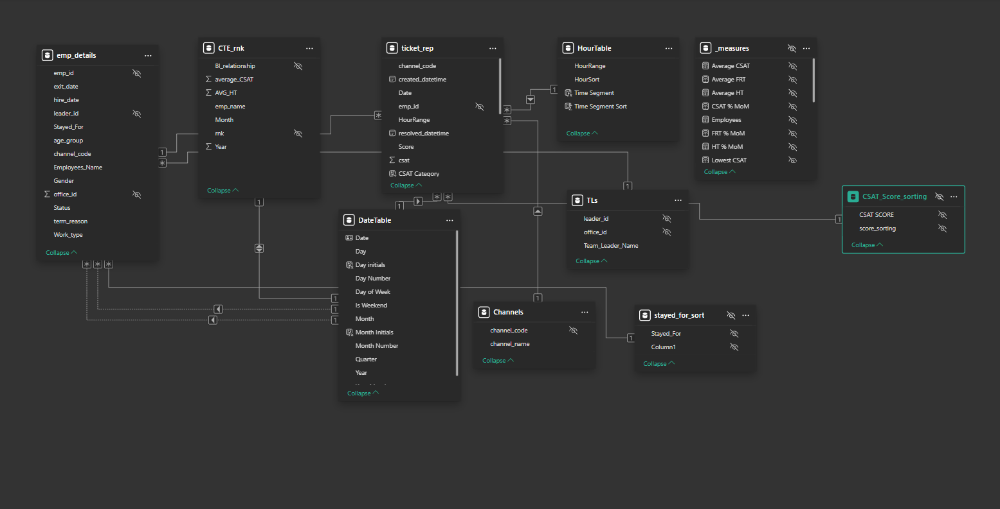
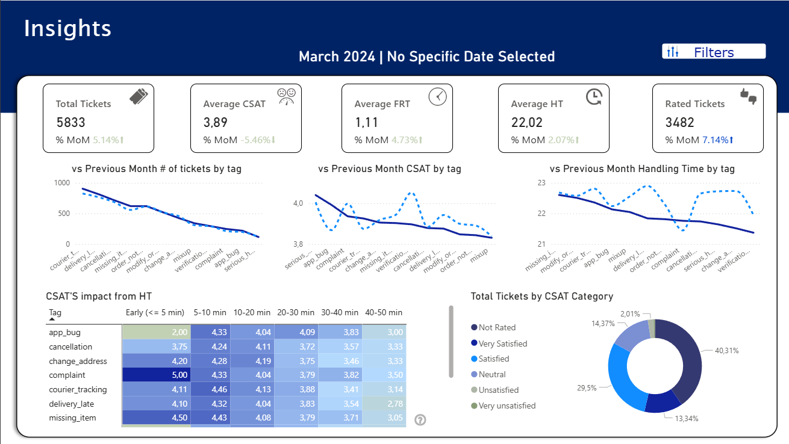
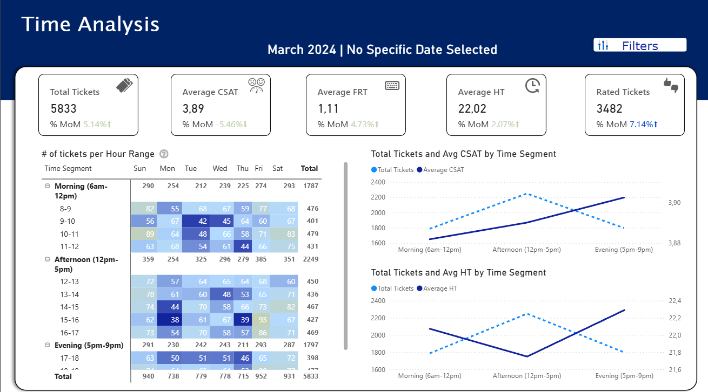

# Power BI Dashboard

An interactive business intelligence dashboard analyzing customer support operations, providing actionable insights on employee performance, ticket metrics, and customer satisfaction across Greece, Cyprus, and Malta.

## Data Model

## Data Architecture

### Data Sources

**SQL Server Database (DBSupp_BI,connected to Power BI in Import Mode)**
- `emp_details` view - Employee demographics and analytics
- `ticket_rep` view - Enhanced ticket metrics with time segmentation
- `offices` table - Office locations
- `channels` table - Country/region codes (Greece, Cyprus, Malta)
- `teamleaders` table - Team management hierarchy

### Power BI Enhancements

**Custom Tables Created:**
- **DateTable** - Calendar dimension for time-based analysis and MoM comparisons
- **HourTable** - Hour dimension for granular time-of-day workload analysis

**Data Modeling:**
- Configured relationships between fact and dimension tables using star schema

**DAX Measures:**
- **Performance Metrics**: Average FRT, Average HT, Total/Rated Tickets
- **CSAT Calculations**: Average CSAT with trend analysis
- **Trend Analysis**: MoM percentage changes for all key metrics
- **Time Segmentation**: Hourly and time-of-day aggregations

## Dashboard Pages

### 1. MED Support Overview

**Country-Level Analysis for Cyprus, Greece, and Malta:**
- Total Tickets with % MoM change
- Average Handling Time (minutes)
- Average CSAT score displayed as gauge chart with deviation from target
- Weekly trend sparklines
- **Most Frequent Issues** with bookmark toggle between Top 3 and Bottom 3

---

### 2. Insights

**Key Metrics with MoM indicators:**
- Total Tickets
- Average CSAT
- Average FRT (minutes)
- Average HT (minutes)
- Rated Tickets

**Analytics:**
- **vs Previous Month # of tickets by tag**: Comparison showing volume changes across issue categories
- **vs Previous Month CSAT by tag**: Performance variation across different issue types
- **vs Previous Month Handling Time by tag**: Efficiency analysis per ticket category
- **CSAT's Impact from Handling Time**: Heatmap showing satisfaction scores across handling time ranges
- **Total Tickets by CSAT Category**: Donut chart distribution

---

### 3. Time Analysis

**Key Metrics with MoM indicators:**
- Total Tickets
- Average CSAT
- Average FRT (minutes)
- Average HT (minutes)
- Rated Tickets

**Analytics:**
- **# of tickets per Hour Range**: Heatmap matrix showing volume by day of week (Sun-Sat) and hour (Interactive help button describes the meaning of gradient colors)
  - Morning (6am-12pm) with hourly breakdown
  - Afternoon (12pm-5pm) with hourly breakdown
  - Evening (5pm-9pm) with hourly breakdown
  - **Total Tickets and Avg CSAT by Time Segment**: Dual-axis line chart showing volume vs satisfaction trends across Morning, Afternoon, and Evening periods (with drill-down capability to hourly breakdown)
  - **Total Tickets and Avg HT by Time Segment**: Dual-axis line chart showing volume vs handling time patterns throughout the day (with drill-down capability to  hourly breakdown)

---

### 4. Employee's Performance

**Key Features:**
- **Employee search functionality** for quick lookup
- **Comprehensive performance table** showing (help button describes column metrics):
  - Employee Name with ranking
  - Total Tickets handled
  - Average CSAT score
  - Average FRT (minutes)
  - Average HT (minutes)
  - Rated Tickets count
  - Resolved Tickets percentage (%)
  - Color-coded performance indicators

**Employee of the Month Spotlight:**
- Highlighted top performer with name, HT, and CSAT metrics

**Analytics:**
- **Over Month CSAT's Progress**: Line chart comparing current month average CSAT with previous month across the year
- **Over Month HT's Progress**: Line chart comparing current month average handling time with previous month trends

---

## Interactive Features

- **Custom Filter Menu**: Bookmark-driven navigation with slicers for Year, Month, Quarter, Specific Dates, Channel to enable deeper analysis

- **Contextual Help Tooltips**: Interactive buttons providing detailed explanations of heatmap color gradient interpretations
  
